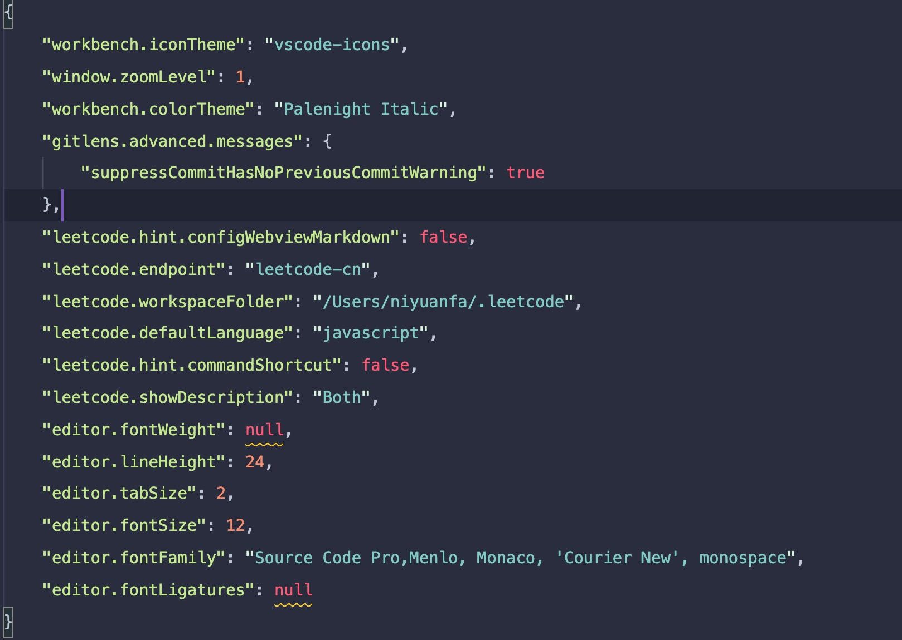

学习笔记

# 工欲善其事必先利其器

## 1. 设置 vscode 主题

    首选项->颜色主题 Plenight Italic

## 2. 设置文件图标

    首选项->文件图标标题 Vscode icons

## 3. 设置字体



## 4. 毛玻璃特效

> https://juejin.cn/post/6844903846871842823

## 5 .top tips vscode

> https://code.visualstudio.com/shortcuts/keyboard-shortcuts-macos.pdf

- `cmd+k+v ` 预览 markdown

# 五毒神掌刷题

- 查看题目，理清思路，自顶向下编程
- 不要死磕，查看题解，理解题解
- leetcode-cn 查看题解后，完成两边答题
- 上全球站查看 most voted，学习思路理解
- 刷遍数

# 初入算法界

## 打卡算法题

- day1 爬楼梯
  - 解决思路
    1. f(n) = f(n-1) + f(n-2)
    2. 斐波拉契数列
- day2 加一
  - 解决思路
    1.  暴力法，将通过循环将数组转化成非负整数，进行加一，再将整数转成字符串再转成数组(js 整数最大值)失败
    2.  将数组最后一位+1,如果向前进位(即 10 取余==0)，如果结果不是 0，就是进位结果，如果全是 9 的情况,数组需要多加一条，首位是 1，其他都是 0
- day3 两数之和
  - 解决思路
    1.a+b=taget,遍历数组，for(let x=0;x<arr.length-1,x++){for(let y=x+1;y<arr.length,y++){}}通过这样的循环拿到等于 target 的值
- day4 两两交换链表中的节点
  - 解决思路 1.递归，如果 head 是 null 或 head.next 是 bull,递归结束,互换链表顺序，返回互换后的 next
- day5 合并两个有序链表
  - 解决思路 1.递归，将两个链表，大的放在小的 next 后面
  - 补充
    1. `Array(len)`新建长度为 len 的数组
    2. `Array.map(_=>0)` 将数组所有元素置为 0
    3. `Array.fill(0)` 用一个固定值填充一个数组中从起始索引到终止索引内的全部元素。
    4. `Math.pow(10,n)` 计算 10 的 n 次方
    5. ```
        let len = Arrary.length
        for(let x = len-1;x>=0;x--)
       ```
       数组从右向左遍历

## 1.链表、跳表

1. linkList.js 用 js 实现的链表数据结构
2. 特点

- 跳表将链表维度升至二维，方便搜索

## 2.栈

- 先进后出
- 类比容器

## 3.队列

1. queue.js 用 js 实现的队列数据结构
2. 特点

- 先进先出
- 类比排队
